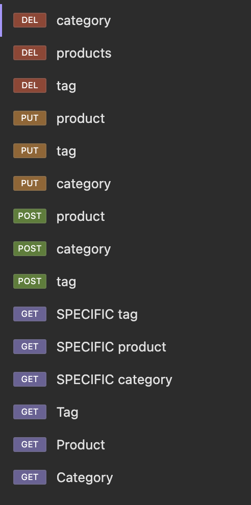
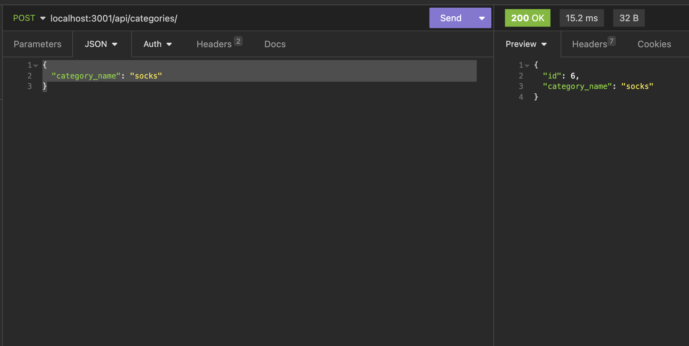
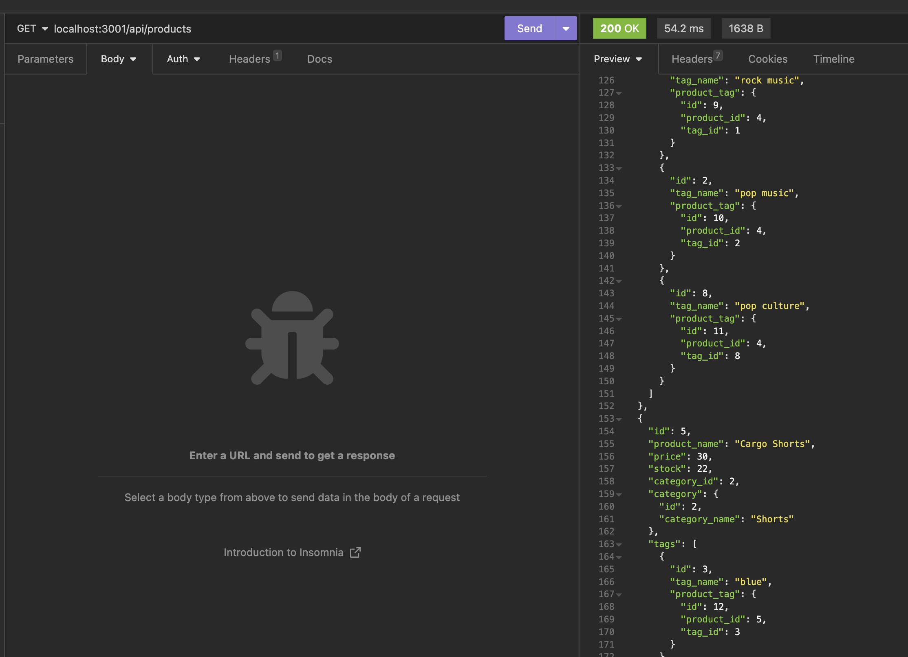
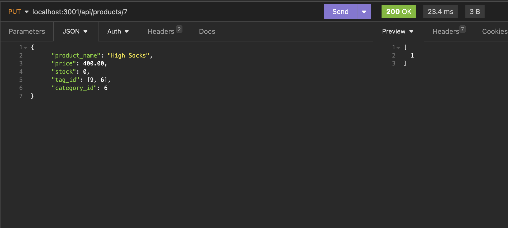
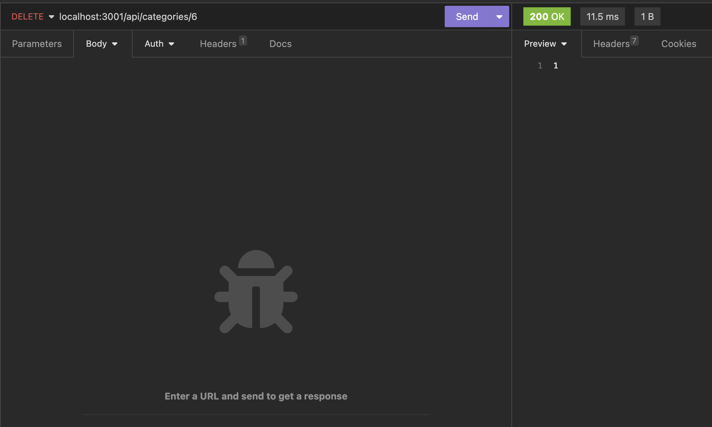

# Online Store Backend

## Description

This project makes an e-commerce store backend that allows you to maintain your inventory for your online store.
The motivation behind this app was to produce a product that could allow you to maintain an online store inventory and to allow you to keep it organized.
This project solves that by allowing you to quickly create, read, update and delete products in your inventory.
By completing this project I was able to demonstrate principals i learned in bootcamp coding class.

## Table of Contents

- [Installation](#Installation)
- [Useage](#Useage)
- [Credits](#Credits)
- [License](#License)
- [Tests](#Tests)
- [Questions](#Questions)

## Installation

Create a database in sequel using the "db" schema.

Run the following commands in your integrated terminal.
"start": "node server.js",
"watch": "nodemon server.js",

To seed the database with generic data run the following command:
"seed": "node seeds/index.js"

## Useage

After you have your server up and running you can can then perform create, read, update and delete functions using insomnia. Its a good idea to set up pre-made calls that can easily be recalled.

Create new products, categories and tags

Read lists of existing products, categories and tags

Update products, categories and tags

Delete existing products, categories and tags

## Credits

Thank you to my bootcamp instructors, Roger and Sasha for the instruction that allowed me to build my app.

## License

MIT License

## Tests

https://watch.screencastify.com/v/m8gKagbcEBb5U9kdPYhe

## Questions

https://github.com/coulterkyle

For questions regarding this app, contact me at:

e-mail: kcoulter2002@gmail.com